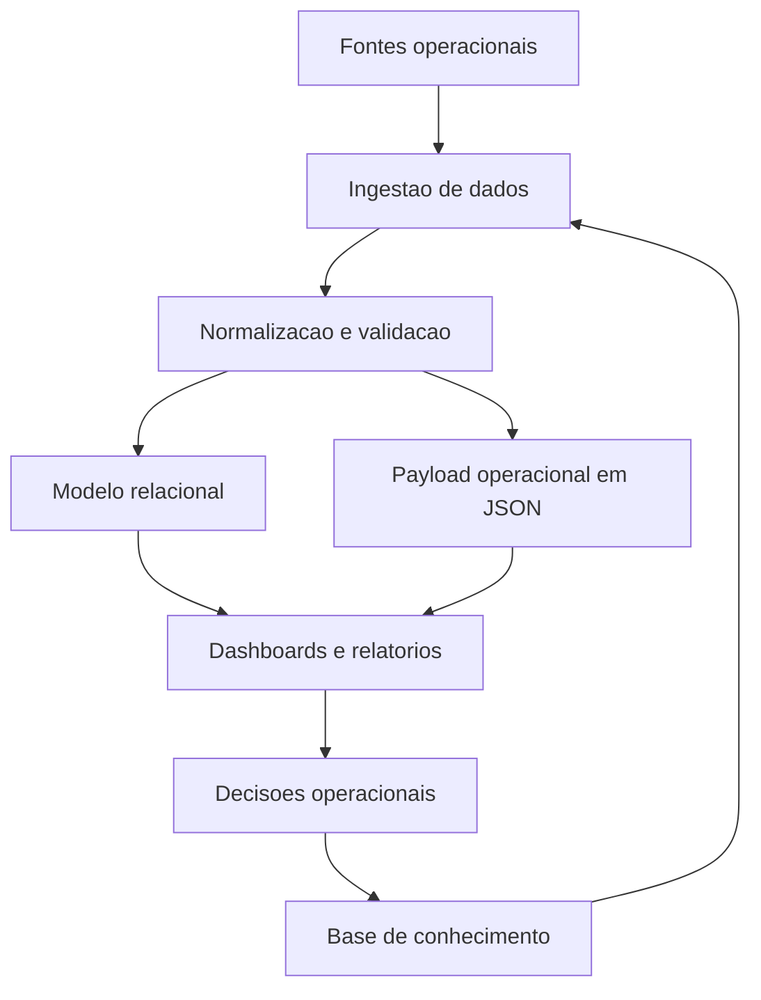

# Obsidian_Cerebro_Operacional

> Um cerebro forte conecta toda a operacao.

## Visao Geral

Este projeto apresenta uma arquitetura de dados e inteligencia operacional voltada para ambientes logisticos complexos.

A proposta e transformar dados operacionais dispersos em decisoes centralizadas, inteligentes e acionaveis.

Sem expor dados sensiveis, esta estrutura demonstra como integrar multiplas fontes operacionais em um unico cerebro analitico.

## Conceito

A operacao logistica moderna nao e linear. Ela envolve multiplos pontos:

- Transporte maritimo
- Transporte rodoviario
- Transporte ferroviario
- Terminais portuarios
- Fluxos de carga e armazenagem

Sem uma central de inteligencia, esses elementos operam de forma desconectada.

Este projeto propoe um cerebro operacional centralizado que conecta, analisa e direciona toda a cadeia.

## Arquitetura Conceitual

## Arquitetura de Dados

A arquitetura segue um modelo escalavel e desacoplado.

### Camadas

1. **Ingestao de Dados**
   - Dados operacionais
   - Reservas, cargas, eventos e programacoes
   - Inputs de multiplos sistemas

2. **Processamento**
   - Normalizacao
   - Validacao
   - Enriquecimento
   - Classificacao operacional

3. **Armazenamento**
   - Banco relacional estruturado
   - Tabelas analiticas
   - Payloads flexiveis em JSON para arquivos com layouts variaveis

4. **Consumo**
   - Dashboards
   - Relatorios operacionais
   - Analises de capacidade
   - Registro de decisoes em Markdown

## Componentes do Projeto

| Componente | Finalidade |
|---|---|
| `schema.sql` | Modelo publico e generico das tabelas analiticas e operacionais. |
| `docs/sanitized-architecture-notes.md` | Regras de sanitizacao e arquitetura publica. |
| `examples/sample_payload_schema.json` | Exemplo anonimizado de payload operacional. |
| `.gitignore` | Bloqueia planilhas, CSVs, HTMLs gerados, credenciais e caches locais. |

## Modelo de Dados

O projeto usa dois padroes complementares.

### Tabelas Analiticas

Indicadas para dados recorrentes com campos estaveis:

- referencia operacional
- origem e destino
- tipo de equipamento
- unidades e TEUs
- janela de servico
- arquivo de origem
- timestamp de carga

### Payload Operacional

Indicado para arquivos finais ou fontes com multiplas abas e layouts variaveis.

Cada linha preserva:

- arquivo de origem sanitizado
- aba de origem
- tipo de operacao
- categoria da fonte
- identificador operacional generico
- payload completo em JSON
- timestamp de carga

Esse padrao evita perder campos importantes quando a fonte muda de formato.

## Fluxo Operacional

1. Receber arquivos operacionais em pasta local privada.
2. Normalizar dados em uma camada de processamento.
3. Validar campos, datas, quantidades e tipos.
4. Carregar tabelas analiticas ou payloads operacionais.
5. Gerar dashboards e relatorios.
6. Registrar decisoes, regras e rotinas no cerebro em Markdown.
7. Reprocessar quando fontes, regras ou programacoes mudarem.

## Regras Implementadas

- Padronizacao de campos operacionais inconsistentes.
- Consolidacao de cargas por janela operacional.
- Separacao entre dado comercial planejado e dado operacional confirmado.
- Classificacao de equipamentos por codigo ISO antes de textos auxiliares.
- Uso de payload JSON para preservar fontes com estrutura variavel.
- Documentacao das decisoes em uma base de conhecimento versionavel.

## Classificacao de Equipamentos

| Padrao ISO | Tipo Normalizado |
|---|---|
| `20G*`, `22G*`, `2200`, `2210` | `DC20` |
| `22R*` | `RH20` |
| `22P*` | plataforma ou flat rack 20 ft |
| `22U*` | open top 20 ft |
| `42G*` | `DC40` |
| `42R*`, `45R*` | `RH40` |
| `42P*`, `45P*` | flat rack 40 ft |
| `42U*`, `45U*` | open top 40 ft |
| `45G*`, `45B*`, `45V*`, `4500`, `4510` | `HC40` |

## Seguranca e Dados

Este repositorio nao deve conter:

- nomes reais de empresas
- nomes reais de navios
- nomes reais de clientes
- rotas internas
- sites, links ou URLs privadas
- chaves de API
- URLs de banco de dados
- caminhos absolutos de maquinas privadas
- planilhas originais
- CSVs gerados com dados reais
- dashboards HTML com dados reais

## Publicacao

Antes de publicar:

- manter apenas arquivos sanitizados
- revisar Markdown, SQL e exemplos
- rodar uma busca por termos sensiveis
- confirmar que `.gitignore` esta ativo
- publicar em repositorio separado do ambiente operacional privado

## Licenca

Defina uma licenca apenas se o projeto for realmente aberto. Para portfolio privado, mantenha sem licenca publica.
