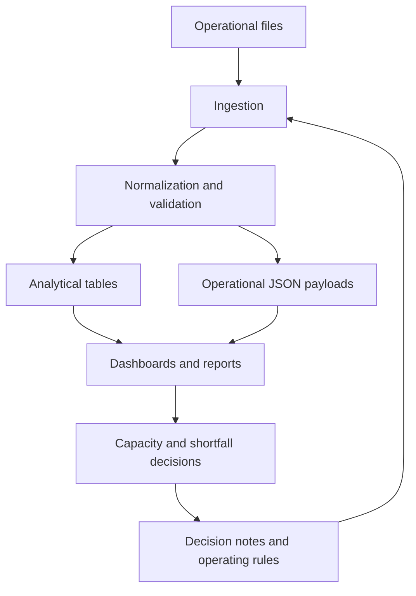

# Operational Intelligence Architecture

Public architecture for connecting operational files, business rules, dashboards, and decision records in complex logistics environments.

This repository is not an abstract knowledge-base idea. It documents the architecture behind an operational workflow where vessel planning data, booking references, gate-in status, capacity rules, and execution notes need to be connected before decisions are made.

## Problem It Solves

In container shipping operations, decision data often lives across spreadsheets, reports, messages, local folders, and individual experience.

That creates practical problems:

- the same vessel can have multiple competing views;
- capacity risk is found late;
- planning rules stay in people's heads;
- execution changes are hard to audit;
- teams lose time rebuilding context before acting.

This architecture turns that scattered context into an operational intelligence layer.

## Where It Was Used

The architecture supports maritime capacity planning and shortfall analysis workflows:

- booking control;
- BAPLIE-style operational files;
- capacity planning by port, TEU, weight, and equipment;
- gate-in visibility;
- final moves;
- decision notes in Markdown;
- dashboards and HTML reports for review.

## Decision Flow

## What Changed Operationally

- Manual review became a repeatable workflow.
- Capacity and shortfall questions were answered before execution.
- Planning, commercial, and execution teams could use the same decision numbers.
- Rules became versionable instead of living only in memory.
- Operational exceptions became easier to explain and prioritize.

## Components

| Component | Purpose |
| --- | --- |
| `schema.sql` | Public, generic data model for analytical and operational tables. |
| `docs/sanitized-architecture-notes.md` | Public notes on sanitization and architecture boundaries. |
| `examples/sample_payload_schema.json` | Anonymized example of flexible operational payload storage. |
| `.gitignore` | Blocks spreadsheets, CSVs, generated HTML, credentials, and local caches. |

## Data Model

The architecture uses two complementary patterns.

### Analytical Tables

Best for recurring fields:

- operational reference;
- origin and destination;
- equipment type;
- units and TEUs;
- service window;
- source file;
- load timestamp.

### Operational Payloads

Best for final files or sources with variable layouts.

Each row preserves:

- sanitized source file;
- source sheet;
- operation type;
- source category;
- generic operational identifier;
- full JSON payload;
- load timestamp.

This preserves important fields when the source format changes.

## Implemented Rules

- Standardization of inconsistent operational fields.
- Separation between planned commercial demand and confirmed operational data.
- Classification of equipment by ISO code before auxiliary descriptions.
- Use of JSON payloads for variable source structures.
- Documentation of decisions and routines in a versionable knowledge base.

## Equipment Classification Example

| ISO Pattern | Normalized Type |
| --- | --- |
| `20G*`, `22G*`, `2200`, `2210` | `DC20` |
| `22R*` | `RH20` |
| `22P*` | 20 ft platform or flat rack |
| `22U*` | 20 ft open top |
| `42G*` | `DC40` |
| `42R*`, `45R*` | `RH40` |
| `42P*`, `45P*` | 40 ft flat rack |
| `42U*`, `45U*` | 40 ft open top |
| `45G*`, `45B*`, `45V*`, `4500`, `4510` | `HC40` |

## Data Responsibility

Public examples are sanitized. Operational intelligence must protect sensitive data, preserve confidentiality, and expose only the logic needed to demonstrate the architecture.
